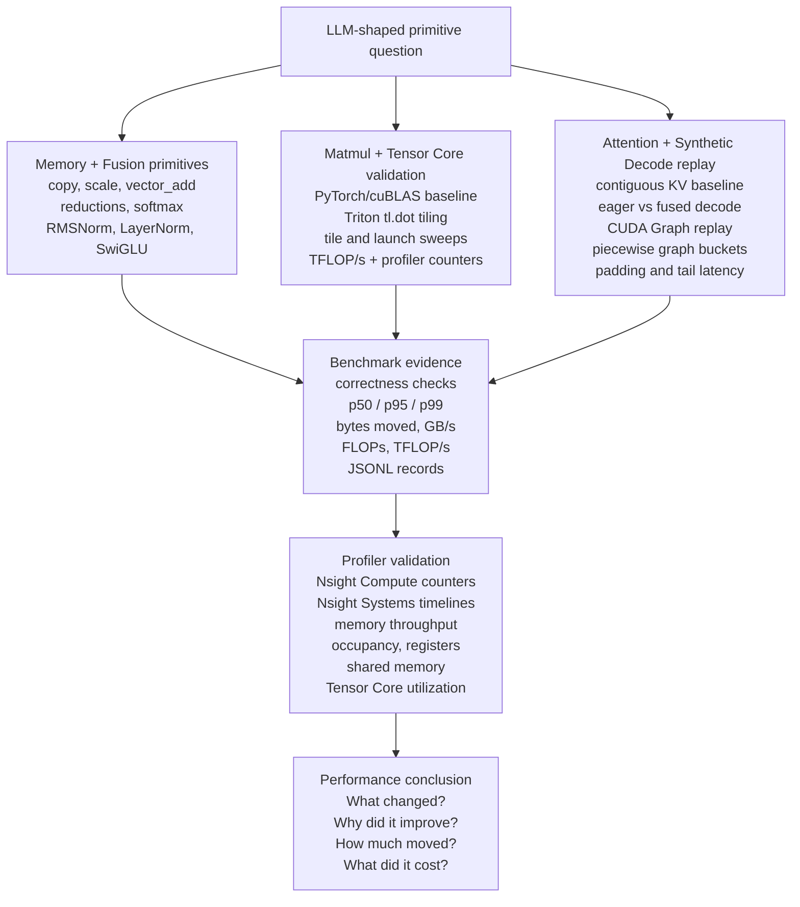

# Project Architecture

CUDA Kernel Lab is a profiling-driven GPU optimization workflow for
LLM-shaped primitives. The repo is organized around one repeatable loop:
choose a primitive question, collect benchmark evidence, validate the bottleneck
with profiler counters or timelines, then write down the performance conclusion.

This is kernel optimization work, not a full inference serving lab. Request
scheduling, queueing, cluster deployment, and service-level tail latency belong
outside this repo.

## Evidence Loop

## Track Boundaries

The memory and fusion track covers low-arithmetic-intensity primitives where
traffic models, coalescing, reductions, and intermediate tensor removal usually
explain the result.

The matmul track moves from tiled `tl.dot` reuse into Tensor Core validation.
Treat TFLOP/s as a benchmark signal, then use profiler evidence before claiming
Tensor Core utilization.

The attention and decode track uses a contiguous KV-cache attention baseline and
synthetic decode-step replay to study launch overhead, CUDA Graph reuse,
dynamic-shape buckets, padding waste, and hot-loop timing. It should be read as
kernel-path evidence, not as a serving-system benchmark.

## Evidence Artifacts

- Benchmark JSONL records live under `experiments/results/`.
- Generated experiment reports live under `experiments/reports/`.
- Compact profiler notes live under `profiling/reports/`.
- Workflow docs describe how to reproduce the benchmark and profiler runs.
